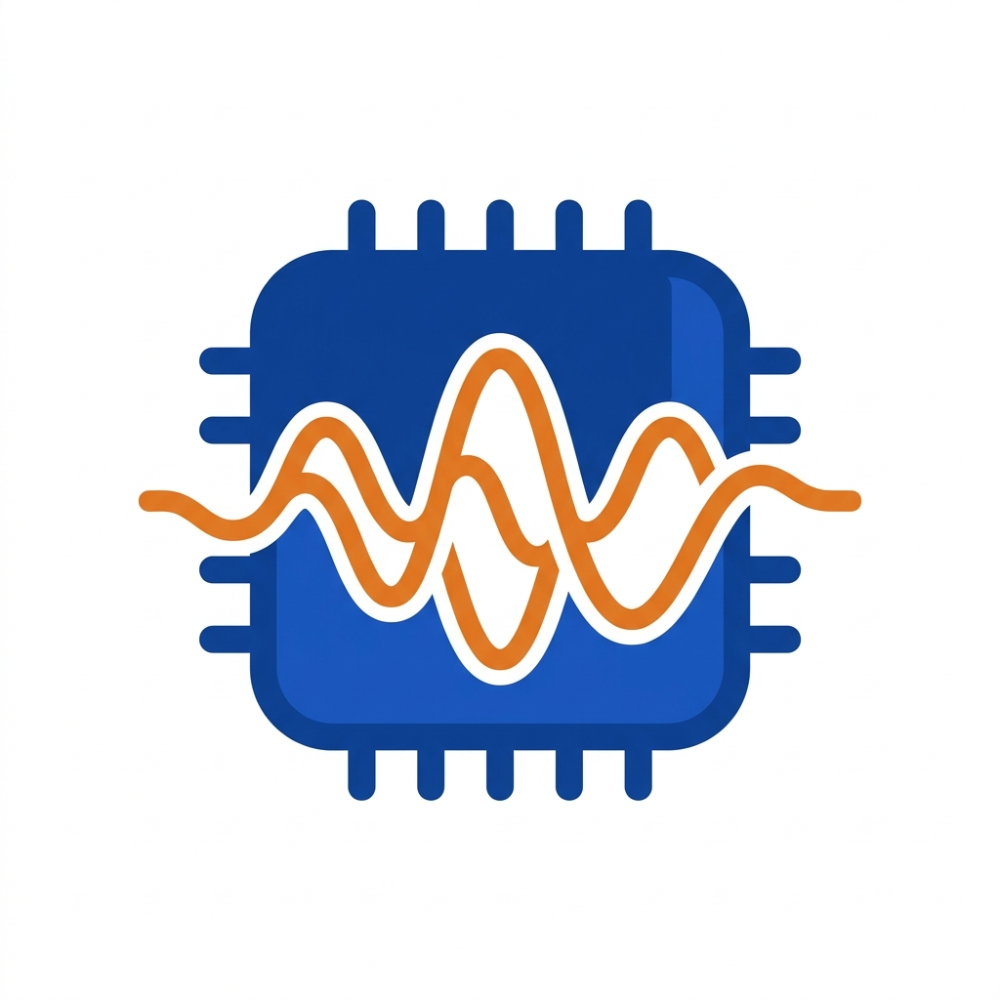

<p align="center">
  
</p>

<h1 align="center">rkvoice-stream</h1>

<p align="center">
  <a href="LICENSE"></a>
  
  
</p>

<p align="center">
  Deploy streaming ASR + TTS on RK3576/RK3588 — <strong>120ms TTS latency, 52-language ASR, one Docker command.</strong>
</p>

<!-- TODO: Add demo GIF here — record a terminal session showing:
     1. docker-compose up (service starts)
     2. curl POST /tts with Chinese text → WAV file plays
     3. WebSocket /asr/stream with microphone → real-time transcription
     Target length: ~15 seconds -->

## What is this?

rkvoice-stream is a ready-to-deploy speech AI service for Rockchip NPU devices. It runs ASR and TTS entirely on-device via RKNN/RKLLM acceleration — no cloud, no GPU, no internet required. Ship it as a Python library or a Docker container.

## Table of Contents

- [Performance](#performance)
- [Features](#features)
- [Supported Platforms](#supported-platforms)
- [Quick Start](#quick-start)
- [API Reference](#api-reference)
- [Architecture](#architecture)
- [Model Preparation](#model-preparation)
- [Configuration](#configuration)
- [Testing](#testing)
- [Acknowledgements](#acknowledgements)
- [License](#license)

## Performance

### ASR — four backends

| Backend | Languages | Type | RK3576 RTF | RK3588 RTF |
|---------|:---------:|------|:----------:|:----------:|
| **Qwen3-ASR** (NPU) | 52 | RKNN + RKLLM | 0.44 | 0.34 |
| **Paraformer** (Hybrid) | 4 | RKNN encoder prefix + CPU suffix/decoder | 0.29 | 0.33 |
| **SenseVoice** (CPU) | 50+ | sherpa-onnx | 0.36 | 0.11 |
| **Paraformer** (CPU) | 4 | sherpa-onnx streaming | 0.50 | 0.24 |

### TTS — two backends

| Backend | Languages | RK3576 RTF | RK3588 RTF |
|---------|-----------|:----------:|:----------:|
| **Matcha + Vocos** | zh, en | 0.19 | 0.10 |
| **Piper VITS** | en, zh, de, fr, ja, … | ~0.05 | ~0.03 |

### Voice-to-Voice (EOS → First Audio)

Streaming V2V latency: time from user stops speaking to first TTS audio chunk.
Audio streamed at real-time pace (simulating live microphone). Qwen3-ASR (NPU) + Matcha TTS.

| Sentence | RK3576 | RK3588 |
|----------|:------:|:------:|
| 你好世界 (1.5s) | 949 ms | **685 ms** |
| 今天天气真不错 (2.0s) | 1604 ms | **1429 ms** |
| 语音识别测试 (3.1s) | 1700 ms | **1408 ms** |
| Hello world (1.7s) | 1289 ms | **644 ms** |
| **Average** | **1385 ms** | **1042 ms** |

## Features

- **ASR: Qwen3-ASR** — streaming + offline, 52 languages, RKNN encoder + RKLLM decoder on NPU
- **ASR: Paraformer RKNN** — experimental hybrid split: FP16 RKNN encoder prefix through block30, CPU ONNX encoder suffix and decoder; boundary parity verified on RK3588 and RK3576
- **ASR: SenseVoice** — offline + VAD streaming, 50+ languages, CPU (sherpa-onnx)
- **ASR: Paraformer** — native streaming, zh/en/ja/ko, CPU (sherpa-onnx)
- **TTS: Matcha + Vocos** — high-quality Chinese/English synthesis, NPU-accelerated vocoder
- **TTS: Piper VITS** — lightweight multi-language TTS (en, zh, de, fr, ja, …), hybrid CPU+NPU
- **Streaming everywhere** — WebSocket ASR (real-time partials), streaming TTS (sentence-by-sentence PCM)
- **Voice-to-voice pipeline** — ASR → LLM → TTS dialogue orchestrator with sub-second first-audio latency
- **NPU accelerated** — runs on Rockchip RKNN/RKLLM, not CPU
- **Config profiles** — pre-validated YAML configs for common setups (ASR-only, TTS-only, full stack)
- **jetson-voice compatible** — same HTTP/WebSocket API, drop-in replacement for RK platforms

## Supported Platforms

| Platform | NPU | CPU | RKLLM Quant | V2V Latency | Status |
|----------|-----|-----|-------------|:-----------:|--------|
| RK3576 | 2 cores, 6 TOPS | 2x A72 + 4x A55 | W4A16 | ~1.1s | Tested |
| RK3588 | 3 cores, 6 TOPS | 4x A76 + 4x A55 | FP16 | **~0.7s** | Tested |

## Quick Start

### Option 1: Docker (recommended)

```bash
# Build
cd docker && docker build -t rkvoice-stream -f Dockerfile .. && cd ..

# Run with pre-validated config
docker-compose -f docker/docker-compose.yml up
```

### Option 2: Python library

```bash
pip install /path/to/rkvoice-stream
```

```python
from rkvoice_stream import create_asr, create_tts

# ASR
asr = create_asr(backend="qwen3_asr_rk", model_dir="/opt/models/asr", platform="rk3576")
result = asr.transcribe("audio.wav", language="Chinese")
print(result.text)

# Streaming ASR
stream = asr.create_stream(language="Chinese")
stream.feed_audio(audio_chunk)
final = stream.finish()

# TTS
tts = create_tts(backend="matcha_rknn", model_dir="/opt/models/tts", platform="rk3576")
wav_bytes = tts.synthesize("Hello world")

# Streaming TTS
for chunk, meta in tts.synthesize_stream("Hello world"):
    play(chunk)
```

### Option 3: Config profile

```python
from rkvoice_stream import load_config, create_from_config

config = load_config("configs/rk3576-full.yaml")
asr, tts = create_from_config(config)
```

## API Reference

All endpoints are compatible with [jetson-voice](https://github.com/dusty-nv/jetson-voice) clients.

| Method | Path | Description |
|--------|------|-------------|
| POST | `/tts` | Synthesize text to WAV |
| POST | `/tts/stream` | Streaming TTS (PCM chunks) |
| POST | `/asr` | Transcribe audio file |
| WS | `/asr/stream` | Streaming ASR (real-time partials) |
| WS | `/dialogue` | Voice-to-voice dialogue pipeline |
| GET | `/health` | Service health + backend status |
| GET | `/capabilities` | NPU resource usage + conflict info |

## Architecture

```
┌──────────────────────────────────────────────────┐
│  Application Layer                                │
│  FastAPI server, WebSocket streaming, dialogue,   │
│  capability/conflict detection                    │
├──────────────────────────────────────────────────┤
│  Engine Layer (public API)                        │
│  ASREngine ABC + TTSEngine ABC + factories        │
├──────────────────────────────────────────────────┤
│  Backend Layer                                    │
│  Qwen3-ASR (RKNN + RKLLM)  │  Matcha+Vocos      │
│  Piper VITS (RKNN)         │  Qwen3-TTS          │
├──────────────────────────────────────────────────┤
│  Platform + Runtime                               │
│  RK3576/RK3588 configs, RKNN/RKLLM wrappers     │
└──────────────────────────────────────────────────┘
```

Data flow (streaming ASR):
```
Mic → int16 PCM → [WebSocket] → VAD → Mel → RKNN Encoder → RKLLM Decoder → Text
                                                  NPU                NPU
```

Data flow (streaming TTS):
```
Text → Phonemes → Matcha (NPU) → Mel → Vocos (NPU) → ISTFT (CPU) → PCM → [WebSocket]
```

## Model Preparation

Models are not bundled — use the conversion scripts in `models/` to generate them:

```
models/
├── asr/qwen3/       # RKNN encoder, RKLLM decoder, matmul weights
├── tts/matcha/       # Matcha+Vocos RKNN conversion + ONNX fixes
├── tts/piper/        # Piper VITS split (CPU encoder + NPU decoder)
├── tts/kokoro/       # Kokoro RKNN fixes
└── common/           # Shared tools: Sin→polynomial, ScatterND bake, Erf→Tanh
```

Expected model layout on the device:

```
/opt/models/
├── asr/
│   ├── encoder/rk3576/*.rknn
│   ├── decoder/rk3576/*.rkllm
│   ├── embed_tokens.npy
│   ├── mel_filters.npy
│   └── tokenizer.json
└── tts/rk3576/
    ├── matcha.fp16.rknn
    └── vocos.w4a16.rknn
```

## Configuration

Pre-validated profiles in `configs/`:

| Profile | Description |
|---------|-------------|
| `rk3576-full.yaml` | ASR + Matcha TTS (split NPU cores) |
| `rk3576-paraformer-matcha.yaml` | Paraformer RKNN ASR + Matcha TTS |
| `rk3576-asr-only.yaml` | ASR with both NPU cores |
| `rk3576-tts-only.yaml` | Matcha TTS only |
| `rk3576-piper-multilang.yaml` | Piper multi-language TTS |
| `rk3588-full.yaml` | RK3588 full stack |
| `rk3588-paraformer-matcha.yaml` | RK3588 Paraformer RKNN ASR + Matcha TTS |

Use via Docker:
```bash
docker run -e CONFIG=rk3576-full rkvoice-stream
```

Enable the experimental Paraformer hybrid ASR container profile with an
artifact directory mounted at `/opt/asr/paraformer`:

```bash
PARAFORMER_HOST_MODEL_DIR=/home/cat/models/paraformer-hybrid \
PARAFORMER_CONTAINER_RKNN_DIR=/opt/asr/paraformer/rknn/rk3576 \
docker compose -f docker/docker-compose.yml \
  -f docker/docker-compose.paraformer-hybrid.yml \
  --profile paraformer-hybrid up -d
```

This profile uses the published arm64 image
`sensecraft-missionpack.seeed.cn/solution/seeed-local-voice:rk-v1.5-paraformer-hybrid`.
Published digest: `sha256:8dec7528ed4e08b919f0b2fd9192b8564d2b713df8552aed3eb98202c0a2c194`.
For RK3588 set `PARAFORMER_CONTAINER_RKNN_DIR=/opt/asr/paraformer/rknn/rk3588`.
Export/upload scripts live under `models/asr/paraformer/`; generated artifacts
are stored in the existing RK artifact repo under
`harvestsu/seeed-local-voice-rk-artifacts/paraformer-hybrid/`.

Measured hybrid ASR performance uses the same Python pipeline baseline with
full ONNX Runtime vs RKNN prefix + ONNX suffix/decoder. RK3576 improved from
0.58 RTF to 0.29 RTF, and RK3588 improved from 0.63 RTF to 0.33 RTF. The
actual `paraformer_rknn` backend entry measured 0.21 RTF on the 10.05s
validation sample on RK3576. The container profile has also been rebuilt and
validated on real RK3576/RK3588 devices with the same validation sample.

## Testing

Dual-mode test suite — works against a live container or directly on device:

```bash
# On device (direct mode)
pytest tests/ -v

# Against running container (HTTP mode)
SERVICE_URL=http://192.168.1.100:8621 pytest tests/ -v
```

Quality gates: CER < 0.5 per sentence, RTF < 1.0.

## Acknowledgements

Built on top of these projects:

- [sherpa-onnx](https://github.com/k2-fsa/sherpa-onnx) — speech inference engine (Piper, Kokoro, VAD)
- [Qwen3-TTS](https://github.com/QwenLM/Qwen3-TTS) — Qwen3 TTS model
- [Matcha-TTS](https://github.com/shivammehta25/Matcha-TTS) — non-autoregressive TTS
- [Piper](https://github.com/rhasspy/piper) — fast local neural TTS
- [RKNN-Toolkit2](https://github.com/airockchip/rknn-toolkit2) — Rockchip NPU SDK
- [RKLLM-Toolkit](https://github.com/airockchip/rkllm-toolkit) — Rockchip LLM SDK

## License

[Apache-2.0](LICENSE)
